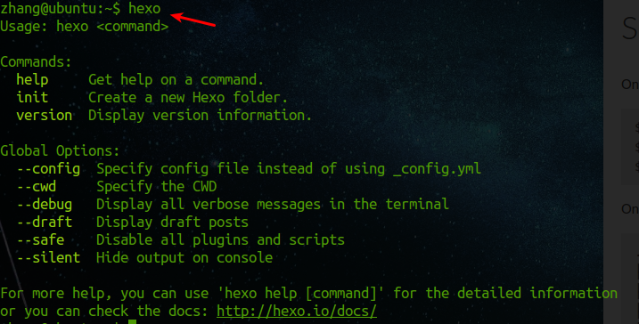
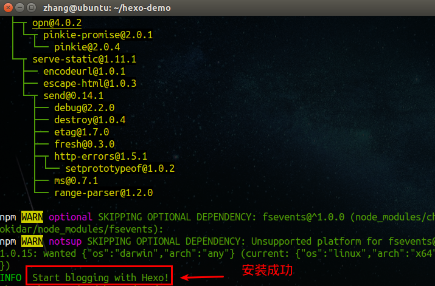
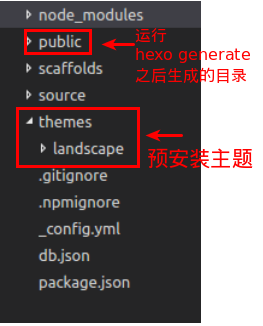
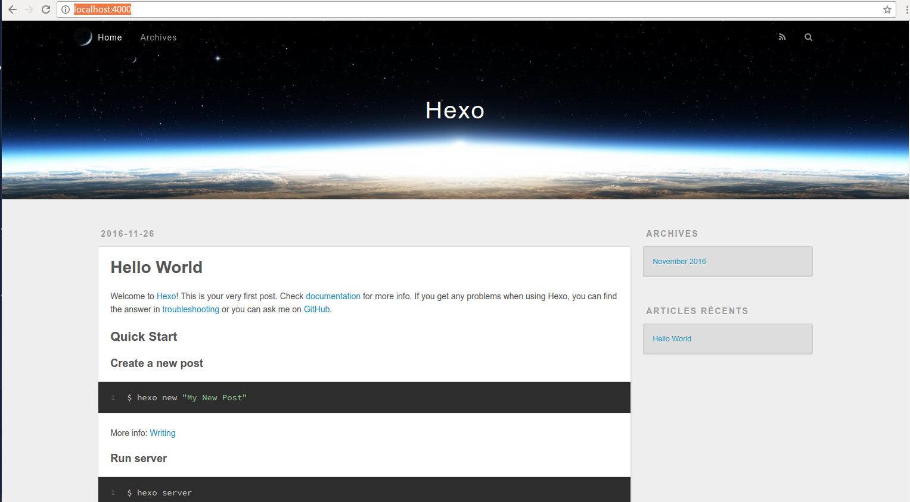
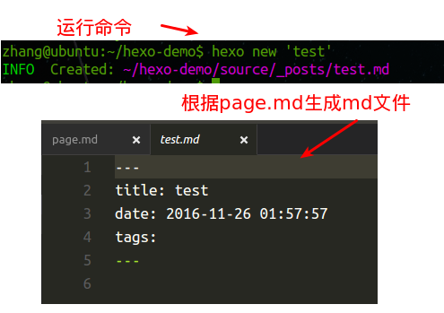

# hexo

## 1. 入门

### 1.1 安装hexo

需要先安装

* git
* node

```shell
npm install -g hexo-cli
```

安装之后，在linux环境下，可以将`hexo`配置到可执行路径上。我是通过软链接的方式

```shell
sudo ln -s /node安装目录/lib/node_modules/hexo-cli/bin/hexo /usr/local/bin/hexo
```

添加之后，就可以直接执行hexo命令（顺便说一下，只要是node的全局安装命令，如果想要在shell直接执行都可以采用这种配置思路）。



之后就可以使用hexo命令来创建我们的项目。

```shell
hexo init <folder>
```

官方文档中，在此基础上还需要运行`npm install`安装依赖，但是由于我们安装的是`hexo-cli`，已经帮我们把这一步骤免去了，因此init的过程中会顺便帮我们安装好依赖。这个过程需要等待一段时间，下载比较慢。



安装之后，我们cd到该文件夹下，用编辑器打开，可以看到这样的目录结构



我们直接在命令行运行

```shell
hexo server
```

之后打开网址`http://localhost:4000/`就可以看到整体的效果。



### 1.2 项目结构简述

下面分别介绍一下目录和配置文件的作用。

* public是运行hexo generate生成的静态文件资源，也就是我们要部署到git pages的静态资源。

* source是我们使用markdown写博客的目录，在这个目录下，

    * 在这个目录下还有一个文件夹_post，当我们使用命令行创建新的文章时，就会在这个文件夹下生成一个新的md文件
    * 在这个文件夹下，hexo只会解析html和md文件，并且将文件解析之后放到public文件夹下，而其他类型的文件就只是复制到public文件夹下，不做处理。

* scaffolds存放一些类似于模板一样的文件，init之后默认有三个文件，分别是

    * draft.md
    * page.md
    * post.md

    当我们运行`hexo new 'test'`时，根据page.md中的格式，生成一个test.md，并且以page.md为模板

    

* themes这个目录下存放了我们安装的主题，主题决定了网站的样式和结构，默认安装的是`landscape`

* _config.yml hexo项目的配置文件，可以配置项目的各种东西，包括部署、页面主页信息、语言、网址、还有各个目录的作用等等，后面会详述。

* db.json 静态常量数据库，描述hexo项目中的静态页面的信息。

* package.json node配置文件


